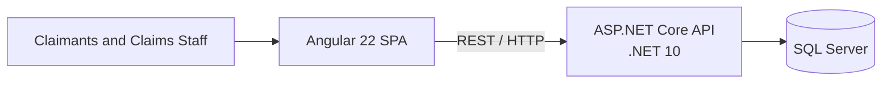

# Plan

## High-Level Architecture

```mermaid
flowchart LR
    Users[Claimants and Claims Staff] --> SPA[Angular 22 SPA]
    SPA -->|REST / HTTP| API[ASP.NET Core API<br/>.NET 10]
    API --> DB[(SQL Server)]
```

One SPA, one backend, and one database. No Kafka or service split.
